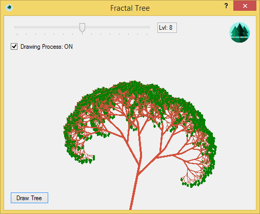
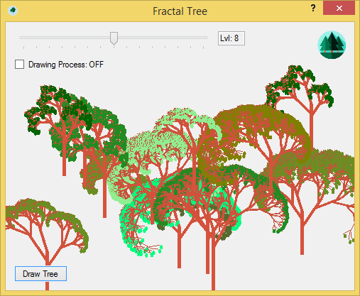

# FractalTree
This program draws a procedural tree using recursive calls to the same method. It also can draw a forest by creating random number of trees with different parameteres.  
  
With the help of trackbar you can change age of a tree.  
By default you can observe the process of drawing the tree step-by-step. To speed up it and view only the final state of drawing, just click on ckeckbox "Drawing Process".  
To view forest you need to click on the image in the rigth corner with trees. Method that is responsible for this feature is called "runForestrun()" :D  
  
